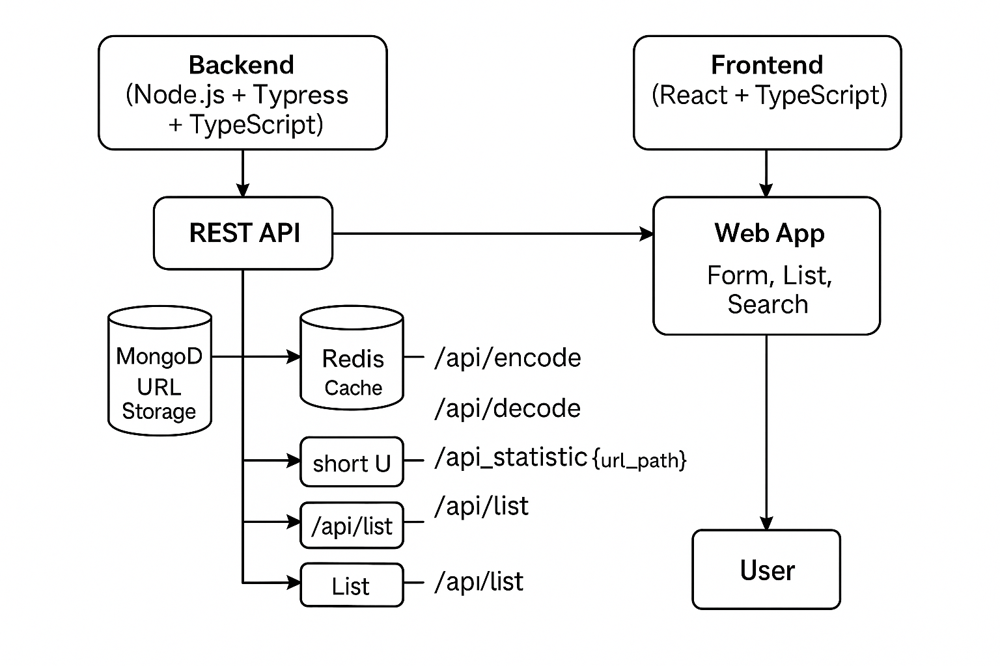

# 🔗 ShortLink — URL Shortener Service

ShortLink is a simple but powerful full-stack URL shortening service. It allows users to create short links for long URLs, track visits, and retrieve statistics through RESTful APIs.

---

## ✨ Stack Overview

- **Backend**: Node.js, TypeScript, Express, MongoDB (via Mongoose), Redis
- **Frontend**: React + Vite + TailwindCSS
- **Testing**: Jest, Supertest
- **DevOps**: Docker + Docker Compose
- **Validation**: Joi
- **Logging**: Winston (with daily rotation)
- **Linting**: ESLint + Prettier
- **Package Manager**: pnpm
* **Node Version Guide** available in [`node_version_guide.md`](./node_version_guide.md):

  * Specifies that the project uses **Node.js v22**
  * Includes a one-liner **bash script** to automatically switch or install the correct version using `nvm`
---

## 🏗 Project Structure

```bash
src/
├── app.ts                # Express setup
├── routes/               # Route definitions
├── controllers/          # Input/Output logic
├── services/             # Business logic layer
├── models/               # Mongoose schema for URLs
├── utils/                # Helpers (short code generation, logger)
├── configs/              # Mongo/Redis configs
├── middleware/           # Validation, error handling
├── constants/            # Constants
├── jobs/                 # Background Redis flusher
tests/                    # Unit & integration tests
```

---

## 🛠 Setup Instructions

### 📥 Clone and Install

```bash
git clone https://github.com/yakubu234/URL-Shortener-Indicina.git
cd URL-Shortener-Indicina
pnpm install
```

### ⚙️ Environment Variables

Create a `.env` file in the root:

```env
PORT=4000
MONGO_URI=mongodb://localhost:27017/short_link
ALLOWED_ORIGINS=http://localhost:8080,http://localhost:3000,http://localhost:4000,http://localhost:5173
ALLOWED_METHODS=GET,POST,PUT,DELETE,OPTIONS
REDIS_HOST=localhost
REDIS_PORT=6379
REDIS_USERNAME=null
REDIS_PASSWORD=null
REACT_APP_API_BASE_URL=http://localhost:4000/api
VITE_API_BASE_URL=http://localhost:4000/api
```

---


## 🚀 Running the Application

### 🔧 Backend (Node.js + Express + TypeScript)

```bash
pnpm install         # Install backend dependencies
pnpm dev             # Starts the backend in dev mode (via ts-node-dev)
pnpm lint:fix        # Auto-fix linting issues
pnpm build           # Compiles backend TypeScript to /dist
pnpm start           # Runs compiled backend code
```

---

### 💻 Frontend (React + Vite + TypeScript)

Navigate to the frontend directory first:

```bash
cd frontend
pnpm install         # Install frontend dependencies
pnpm dev             # Start Vite dev server (localhost:3000)
pnpm build           # Type-check and build frontend for production
pnpm build:dev       # Build frontend in development mode
```

> Ensure `VITE_API_BASE_URL` is correctly set in `frontend/.env`.

---


### Starting the application using script
read more from here:  [`start.sh.usage.md`](./start.sh.usage.md):
---

## 🧭 System Architecture




## 🔁 How It Works

### ➕ URL Encoding

- `POST /api/encode` receives a long URL.
- If the URL exists, returns the existing short version.
- If not, generates a short code, stores it in MongoDB, and caches in Redis.

### ↩️ URL Redirection

- `GET /:shortCode` checks Redis, falls back to MongoDB.
- Increments visit count in Redis (for performance).

### 📊 Statistics

- `GET /api/statistic/:shortCode` returns:
  - Total visits (Mongo + Redis)
  - Last visited timestamp

### 🔍 Search & List

- `GET /api/search?query=...`
- `GET /api/list` for all URLs with metadata

---

## 🚦 Redis Optimization Strategy

- Redirects increment Redis `visitCount:{shortCode}`
- Background job flushes counts to MongoDB
- `flushVisitCounts.ts` runs every minute and resets Redis keys

---

## 📄 API Endpoints

| Method | Endpoint                       | Description                          |
|--------|--------------------------------|--------------------------------------|
| POST   | `/api/encode`                  | Encode a long URL                    |
| POST   | `/api/decode`                  | Decode a short URL                   |
| GET    | `/:shortCode`                  | Redirect to original URL             |
| GET    | `/api/statistic/:shortCode`    | Fetch visit stats                    |
| GET    | `/api/list`                    | List all URLs                        |
| GET    | `/api/search?query=...`        | Search long URLs                     |

📬 **Postman Docs**: [View API Documentation](https://documenter.getpostman.com/view/12538701/2sB2j6BBQt)

---

## 🧪 Testing Strategy

| Type         | Tool        | File                                |
|--------------|-------------|-------------------------------------|
| Unit         | Jest        | `urlService.test.ts`                |
| Controller   | Jest        | `shortlink.controller.test.ts`      |
| Integration  | Supertest   | `api.integration.test.ts`           |
| Edge cases   | Supertest   | `api.negative.test.ts`              |

### Run Tests

```bash
pnpm test:unit         # Run unit tests
pnpm test:integration  # Run integration tests
```

---

## ✅ Dev Best Practices

| Practice             | Status |
|----------------------|--------|
| SOLID Principles     | ✅ Yes |
| Clean Code           | ✅ Yes |
| Redis Optimization   | ✅ Yes |
| Input Validation     | ✅ Yes |
| Logging (Winston)    | ✅ Yes |
| Docker Support       | ✅ Yes |
| Git Discipline       | ✅ Yes (Conventional Commits) |

---

## 🐳 Docker Support

To run everything via Docker:

```bash
docker-compose up --build
```

Services:
- Frontend: [http://localhost:3000](http://localhost:3000)
- Backend: [http://localhost:4000](http://localhost:4000)

---

## 🧠 Ideas for Extension

- Add authentication and URL ownership
- Generate QR codes for shortened links
- Add expiration time for short URLs
- Redis TTL and auto-cleanup jobs

---

## 📌 Commit Convention

```bash
feat: add encode endpoint
fix: handle redirect bug
chore: update dependencies
```

> Enforced with Husky + Commitlint

---

## 🔐 Security Middleware

- `helmet`, `cors`
- `express-rate-limit`, `rate-limiter-flexible`

---

## 💬 Questions?

Open an issue or submit a PR. Thanks for reviewing!
