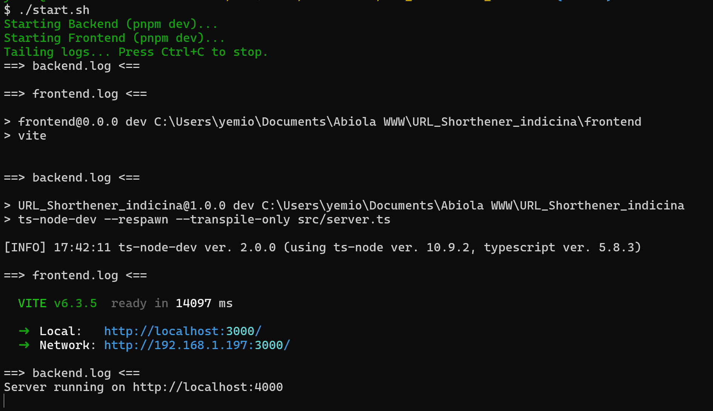

# 🖥️ Start Script for ShortLink Project

This script launches both the backend (Node.js + Express) and frontend (React + Vite) in development mode, while logging output and supporting graceful shutdown (like Ctrl+C).

---

## ⚙️ Prerequisites

Before running the script, ensure the following are installed and properly configured on your machine:

### ✅ Runtime Requirements

| Dependency | Version / Notes |
|------------|------------------|
| Node.js    | v22.x            |
| pnpm       | ≥ 8.x            |
| MongoDB    | Running locally or via Docker |
| Redis      | Running locally or via Docker |

---

## 🔐 Environment Variables

Make sure to create a `.env` file in the root directory with all necessary parameters. Example:

```env
# Backend
PORT=4000
MONGO_URI=mongodb://localhost:27017/short_link
REDIS_HOST=localhost
REDIS_PORT=6379
REDIS_USERNAME=null
REDIS_PASSWORD=null

# Frontend
VITE_API_BASE_URL=http://localhost:4000/api
REACT_APP_API_BASE_URL=http://localhost:4000/api
```

Also ensure that both `frontend/.env` and `src/.env` are configured if applicable.

---

## 🚀 How to Use

1. Make sure you're in the root of the project directory (where `start.sh` is located).
2. Run the following command:

```bash
chmod +x start.sh
./start.sh
```

#### Example Below


✅ While you have the backend running on http://localhost:4000 and the frontend on http://localhost:3000, then you're good to go!
---

## 🧪 What It Does

- Starts the **backend** from the `src/` directory using `pnpm dev`
- Starts the **frontend** from the `frontend/` directory using `pnpm dev`
- Logs backend and frontend output to:
  - `backend.log`
  - `frontend.log`
- Automatically stops both servers when you hit `Ctrl+C`

---

## 📂 Log Files

You can view real-time logs via:

```bash
tail -f backend.log frontend.log
```

---

## ❌ To Stop

Just press `Ctrl+C` and the script will:
- Kill both backend and frontend processes
- Exit cleanly

---

For any issues, verify that:
- Your `.env` files are valid
- Required ports (4000 for backend, 3000 for frontend) are free
- Redis and MongoDB are running properly

Happy coding!

### back to README.md:  [`README.md`](./README.md):